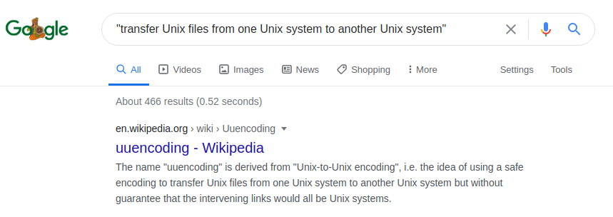
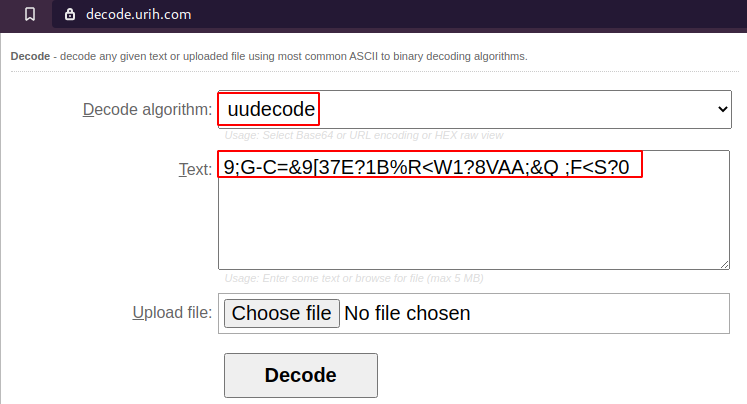

# Writeup for CTFFriday 2020 August Week 2 by Muzkkir

In this article, I’m going to explain solutions of NSCTF August Week 2, 2020 CTF challenge theme on "AWS Cloud" Organized by Net-Square Solutions Pvt. Ltd. and created by Aman Barot. AWS is well known for its cloud computing products and services. Netflix, Twitch, LinkedIn, Facebook, etc. are using AWS services for their platform.

<kbd></kbd>

## Overview

For the First flag, I decoded the uuencoding string which used for file transfer by online service.

After that, I Searched for the bucket on AWS and read the publicly available files. From one of those files, I found my second flag.

Digging into all files I found AWS access credentials from the "_config.yml" file. Configuring the AWS CLI command I had listed all files, functions, and configurations. With the help of lambda functions, I found my third flag.

For the fourth flag, I have one image file and it was in pptx format. So I unzip the file and got one unique GIF file. After decoding the Zxing file I got my Final Flag.


## First Flag

```
challenge 1

Server transfer Unix files from one Unix system to another Unix system and we get this string. Can you please decode this string for me!

9;G-C=&9[37E?1B%R<W1?8VAA;&Q ;F<S?0
```

That challenge was brainstorming and new for me. I have not performed that in past. So, I google-searched about the file transferring and found that.

<kbd></kbd>

After reading the format and usage of uuencoding from Wikipedia I understand that string was captured during the file transferring by some tool. 

<kbd></kbd>

I visited to the "https://decode.urih.com/" website for decoding this encoded string format into readable text.

<kbd></kbd>

I got my first flag. :bowtie:

<kbd></kbd>

```
nsctf{My_F!rst_chall@ng3}
```


## Second Flag

```
challenge 2

Meena is super tech savy for her age, at just over 52 years old, she is the oldest AWS administrator in her county. But old age has its perils. One of them being the inability to grasp new knowledge as quickly as she did when she was aboard the RMS Titanic.

Configuration goof ups have become a weekly thing now with her. Like the domain configuration she has in place for her backup buckets. Or the server she manages. 

I mean, look at the websitesnapshot she has made at Indian region, clearly missing out on utilizing AWS' cool features to save the website and instead ending up with a giant blob. Jack can't seem to make head nor tail of it either and does not believe this is the actual backup. He believes there has to be a proper backup somewhere in that bucket (like the Heart of the Ocean)! 

There is no plank of wood to save Jack this time! Can you help him find the actual backup and use the information in there to find the flag for this level please? Before he sinks again! 
```

This challenge was about to explor the AWS services. Now, let me list important words from this passage.

> AWS service used for website

> "websitesnapshot" is bucket or domain name

> Indian region for AWS

At this point, I search over web about the AWS url format to find my bucket.

<kbd></kbd>

<kbd></kbd>

<kbd></kbd>


